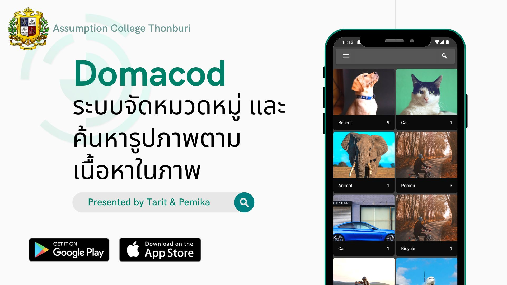

# Domacod

Domacod, an application to index images based on the content of the image. By using object detection and optical character recognition, we categorized images and enabled text searching.

## Video Presentation (Thai)

## Application Download 
Domacod is available on Google Play and App Store. For Android you can also download apk directly on the [release section](https://github.com/wtarit/domacod/releases/tag/v1.0.2) of the app.  

  
  

## Technology
Mobile application - Flutter  
Image categorization - YOLOv4-tiny model (Custom trained)  
OCR - Google Cloud Vision API  
Subject Classification - WangchanBERTa (Custom trained)  

The application work by categorizing the image first. Then if the image is classified to have document in it, it is send to remote server to do OCR and classify the subject using the text from OCR process.  

The image categorization part is running locally on device. We used object detection model since if multiple object is detected the image will be placed in multiple category. The model is deployed using TFlite based on TexMexMax work ([repo](https://github.com/TexMexMax/object_detection_flutter)). We used this ([repo](https://github.com/hunglc007/tensorflow-yolov4-tflite)) to convert darknet model file to tflite.   

For subject classification we run the model on Google App Engine. The code can be found in the backend folder.

## Note
Image categorization - support 14 categories includuing Person, Bicycle, Car, Motorcycle, Airplane, Train, Boat, Bird, Cat, Dog, Animal, Food, Tree, and Document.  

Subject Classification - support 4 subject including Biology, Chemistry, Physics, and Math. (Currently support only thai text for subject classification)

To build app download the model file in the [release section](https://github.com/wtarit/domacod/releases/tag/v1.0.2-asset) and add it to `assets/` folder.  

To generate objectbox database file  
`flutter pub run build_runner build`
